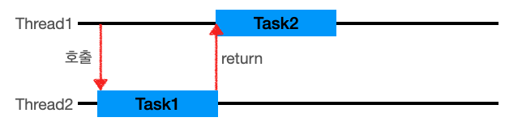
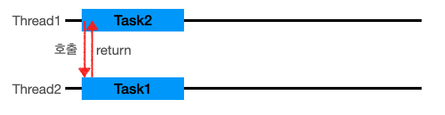

# ✨동기와 비동기

> ***호출되는 함수의 작업 완료 여부를 누가 신경쓰는지***

## 1. 동기

- 어떤 객체 또는 함수 내부에서 다른 함수를 호출했을 때 이 함수의 결과를 ***호출한 쪽에서 처리***
- `Thread1`이 작업을 시작 시키고, `Task1`이 끝날때까지 기다렸다 `Task2`를 시작한다.
- 작업 요청을 했을 때 요청의 **결과값(return)을 직접 받는 것이다**.
- 요청의 결과값이 return값과 동일하다.
- **호출한 함수가 작업 완료를 신경 쓴다.**
- C언어의 scanf()와 Java의 Scanner 객체의 next()메서드 같이 사용자의 입력을 받는 함수들이 그 예
  - *사용자 입력받을 때까지 대기타다가 입력 받으면 작업 수행*

## 2. 비동기

- 어떤 객체 또는 함수 내부에서 다른 함수를 호출했을 때 이 함수의 결과를 ***호출한 쪽에서 처리하지 않음***
- `Thread1`이 작업을 시작 시키고, 완료를 기다리지 않고, `Thread1`은 다른 일을 처리할 수 있다.
- 작업 요청을 했을 때 요청의 **결과값(return)을 간접적으로 받는 것**이다.
- 요청의 결과값이 return값과 다를 수 있다.
- 해당 요청 작업은 별도의 스레드에서 실행하게 된다.
- 콜백을 통한 처리가 비동기 처리라고 할 수 있다.
- **호출된 함수(callback 함수)가 작업 완료를 신경 쓴다.**

# ✨블로킹과 논블로킹

>  ***호출되는 함수가 바로 return 되는지 안되는지***

## 1. 블로킹

- 블로킹은 자신의 수행결과가 끝날 때까지 제어권을 갖고 있는 것
- **요청한 작업을 마칠 때까지 계속 대기**한다.
- 즉시 return한다.
- return 값을 받아야 끝난다.
- Thread 관점으로 본다면, 요청한 작업을 마칠 때까지 계속 대기하며 return 값을 받을 때까지 한 Thread를 계속 사용/대기 한다.

## 2. 논블로킹

- 논블로킹은 자신이 호출되었을 때 제어권을 바로 자신을 호출한 쪽으로 넘기며, 자신을 호출한 쪽에서 다른 일을 할 수 있도록 하는 것
- **요청한 작업을 즉시 마칠 수 없다면 즉시 return**한다.
- 즉시 리턴하지 않는다. (일을 못하게 막는다.)
- Thread 관점으로 본다면, 하나의 Thread가 여러 개의 IO를 처리 가능하다.

---

# ✨조합

##  1. blocking + Synchronous

* 결과가 처리되서 나올 때까지 기다렸다가 return값으로 결과 전달
* ex) *전화를 걸어서  바로 즉답*

##  2. blocking + Asynchronous

* 호출을 하는데 다른 일을 하지 않고 기다리고 있다.
* *ex) 이메일을 보내놓고 답변이 올때까지 다른 일 안하고 기다리는 것*
* 이 방식은 이점이 없어서 사용하지 않는다
  * *의도하지 않게 blocking+Async로 동작하는 경우.. 이는 non-blocking+Async를 추구하다 의도가 변질되어버림... 대표적으로 Node.js + MySQL 조합이라고 한다*

## 3. non-blocking + Synchronous

* 호출 후 결과를 계속 확인하면서 다른 일을 한다.
* 결과가 생길 때까지 확인 후 결과가 있으면 return
* *ex) 상대방이 전화를 받을 때까지 계속 전화를 거는 것*

## 4. non-blocking + Asynchronous

* 호출 후 결과가 나올 때까지 다른 일을 한다
* 작업 요청을 받아서 별도의 프로세서에서 진행하게 하고 바로 return(작업 끝)한다.
* 결과는 별도의 작업 후 간접적으로 전달(callback)한다.
* *ex)메일을 보내고 기다리지 않고 다른 작업을 한다.*

