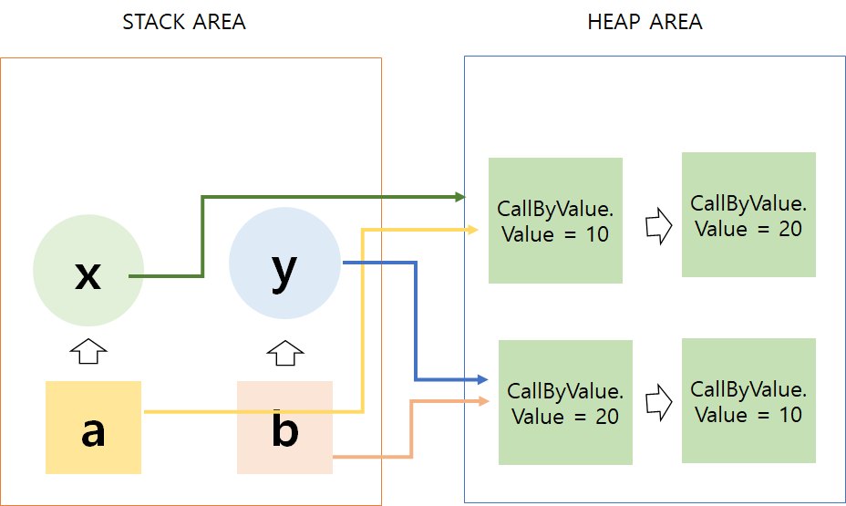

# Call by Value 와 Call by Reference

함수의 호출방법에는 크게 두가지가 있다.

* **Call by value (값 전달)**

* **Call by reference (주소 전달)**

  

## ✨Call by Value

* 값에 의한 호출
*  함수에 매개 변수를 복사해서 처리
*  복사해서 처리하기 때문에 원래의 값이 보존된다.
* 복사하기 때문에 메모리량이 늘어난다.
> **Call by value는 메서드 호출 시에 사용되는 인자의 메모리에 저장되어 있는 값(value)을 복사하여 보낸다.**


##  ✨Call by Reference

* 참조에 의한 호출
* 인자로 받은 값의 주소를 참조해 직접 값에 영향을 주는 것

* 복사하지 않고 직접 참조를 하기 때문에 빠르다
* 직접 참조를 하기 때문에 원래 값이 영향을 받는다.

> **Call by reference는 메서드 호출 시 사용되는 인자 값의 메모리에 저장되어있는 주소(Address)를 복사하여 보낸다.**


## ✨자바는 Call by Value 다

* 이렇게보면 자바는 **call by reference**처럼 보이지만. 자바는 항상 **call by value**다

값을 서로 바꾸는 `swap` 메서드로 알아보기

### Primitive Type (원시타입)

```java
public class CallByValue {
    public static void swap(int x, int y){
        int temp = x;
        x = y;
        y = x;
    }

    public static void main(String[] args) {
        int a = 10;
        int b = 20;
        System.out.println(" 호출 전 : a = " + a + " b = " + b);
        swap(a,b);
        System.out.println(" 호출 후 : a = " + a + " b = " + b);
    }
}

```

> 결과 
> 호출 전 : x = 10 y = 20
> 호출 후 : x = 10 y = 20

* `main()`에 선언된 변수 a와 b가 메모리에 할당된다.
* `swap()` 메서드 호출 시 할당 된 메모리 주소가 아닌 메모리에 담겨져 있던 값만 복사되어 x와 y의 메모리 주소에 담겨지게 된다.
* `swap()` 메서드가 수행하는 동안 사용되는 변수는 `main()` 에 존재하는 a,b가 아닌 **새로 생성된** x,y이기 때문에 수행 후에도 값에 변화가 없다.


### Reference Type (참조자료형)

```java
public class CallByValue {
    int value;
    CallByValue(int value) {
        this.value = value;
    }

    public static void swap(CallByValue x, CallByValue y) {
        int temp = x.value;
        x.value = y.value;
        y.value = x.value;
    }

    public static void main(String[] args) {

        CallByValue a = new CallByValue(10);
        CallByValue b = new CallByValue(20);

        System.out.println(" 호출 전 : a = " + a.value + " b = " + b.value);
        swap(a, b);
        System.out.println(" 호출 후 : a = " + a.value + " b = " + b.value);
    }
}

```

> 결과 
>  호출 전 : a = 10 b = 20
>  호출 후 : a = 20 b = 10

#### 값이 바뀌었는데 왜 Call By Reference가 아닐까?



* `stack area` 에는 객체들이 저장되고 `Heap Area` 에는 값들이 저장된다.
* 메서드를 호출했을 때 **주소 값을 복사** 해서 넘긴다
* 값이 변경될 때 `x` 와 `y` 가 가지고 있는 주소 값을 통해서 value 의 값을 변경한다
* 그렇기 때문에 같은 주소값을 가진 `a`와 `b` 의 값이 변경된 것처럼 보인다

> **메서드를 호출할 때 객체가 객체가 복사되어서 사용되었기 때문에 Call by Value 다**

