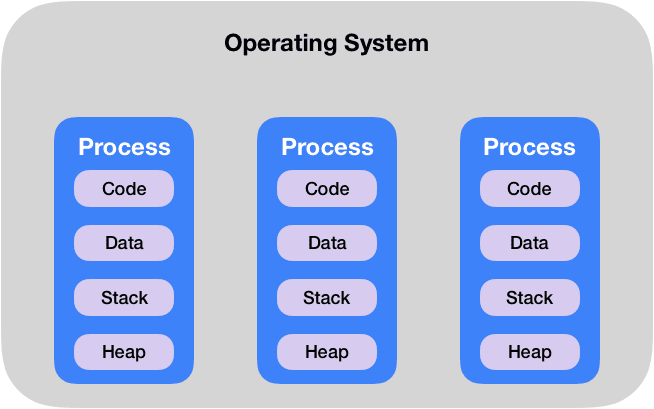
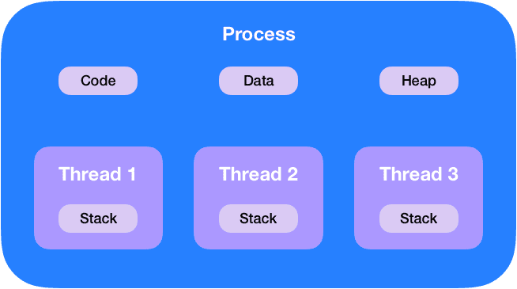

# Process와 Thread

* 프로세스는 운영체제로부터 자원을 할당받는 **작업의 단위**
* 스레드는 할당받은 자원을 이용하는 **실행의 단위**로 프로세스 내에 여러개가 생길 수 있다
* ***어플리케이션 하나가 프로세스고 그 안에서의 분기처리가 스레드가 된다***

## ✨Program

* 어떤 작업을 위해 실행할 수 있는 파일

## ✨Process

* 컴퓨터에서 연속적으로 실행되고 있는 컴퓨터 프로그램
* 메모리에 올라와 실행되고 있는 프로그램의 인스턴스(독립적인 개체)
* 운영체제로부터 **시스템 자원을 할당받는 작업**의 단위
* 즉, 동적인 개념으로는 **실행된 프로그램**을 의미

####  할당받는 시스템 자원

* CPU 시간
* 운영되기 위해 필요한 주소 공간
* Code, Data, Stack, Heap의 구조로 되어 있는 독립된 메모리 영역

#### 특징

* 프로세스는 각각 독립된 메모리 영역(Code, Data, Stack, Heap 구조)을 할당 받는다
* 기본적으로 프로세스당 최소 1개의 스레드 (메인스레드)를 가지고 있다
* 각 프로세스는 별도의 주소 공간에서 실행되며 한 프로세스는 다른 프로세스의 변수나 자료구조에 접근할 수 없다.
* 한 프로세스가 다른 프로세스의 자원에 접근하려면 프로세스간의 통신 (IPC, inter-process communication) 을 사용해야 한다
  * ex) 파이프, 파일, 소켓 등을 이용한 통신 방법

## ✨Thread

* 프로세스 내에서 실행되는 여러 흐름의 단위
* 프로세스의 특정한 수행 경로
* 프로세스가 할당받은 자원을 이용하는 실행의 단위

#### 특징

* 스레드는 프로세스 내에서 각각 Stack만 따로 할당받고 Code, Data, Heap 영역은 공유한다
* 스레드는 한 프로세스 내에서 동작되는 여러 실행의 흐름으로, 프로세스 내의 주소 공간이나 자원들을 같은 프로세스 내에 스레드끼리 공유하면서 실행된다
  * *같은 프로세스 안에 있는 여러 스레드들은 힙 공간을 공유한다 반면 프로세스는 다른 프로세스의 메모리에 직접 접근할 수 없다*

* 각각의 스레드는 별도의 레지스터와 스택을 같고 있지만 힙 메모리는 서로 읽고 쓸 수 없다
* 한 스레드가 프로세스 자원을 변경하면 다른 이웃 스레드(sibling thread)도 그 변경 결과를 즉시 볼 수 있다

